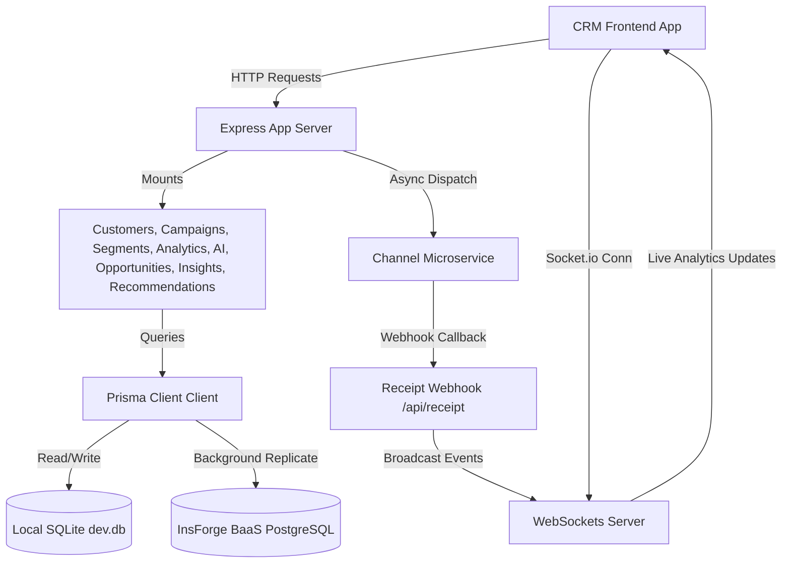

# ReachIQ Backend

> **The Intelligent Opportunity Engine powering Customer Intelligence & Hyper-Personalized Engagement**

This is the backend API service for **ReachIQ**, an AI-powered customer intelligence platform that transforms customer data into actionable revenue opportunities. The backend orchestrates customer ingestion, dynamic cohort segmentation, automated multi-channel campaign launches, AI-driven strategy recommendations, and predictive customer health analytics.

---

## 📋 Overview

The ReachIQ Backend acts as the platform's **Opportunity Engine**, executing key database queries, real-time message broadcasting, and natural language analytics. It features a local SQLite server for developers and integrates with the **InsForge BaaS (PostgreSQL)** in production, replicating operations dynamically across both instances via extended Prisma client queries.

---

## 🛠 Tech Stack

- **Core Framework**: Node.js, Express (with TypeScript / `tsx`)
- **Database**: SQLite (local dev), PostgreSQL (production BaaS via InsForge REST)
- **ORM**: Prisma Client (extended to support background cloud database replication)
- **Real-Time Communication**: Socket.io (HTTP WebSockets for live campaign events)
- **AI Integrations**: Google Gemini 1.5 Flash (via `@google/generative-ai`)
- **Microservice Networking**: Fetch API for webhook receipt and dispatching notifications

---

## 🏗 Architecture

The backend follows a clean, modular router-controller architecture powered by Express and Prisma:



1. **Standalone API Server**: A TypeScript Express server listening on port `3001` handling all core business logic.
2. **Replication Middleware**: Custom query extension in `src/lib/insforge.ts` intercepting Prisma writes and replicating them to the InsForge PostgreSQL cloud in the background.
3. **WebSockets Event Bus**: Instantiates a Socket.io server to push real-time campaign delivery metrics, delivery status updates, and live graphs to connected clients.
4. **Decoupled Simulators**: Connects asynchronously with a mock `Channel Service` on port `3002` that simulates WhatsApp, Email, and SMS network delivery and loops back via webhooks.

---

## 📁 Folder Structure

```
apps/api/
├── prisma/
│   ├── dev.db             # Local SQLite development database
│   ├── schema.prisma      # Prisma schema defining all 10 core models
│   └── seed.ts            # Dynamic DB seed script generating 500 customers & initial logs
├── src/
│   ├── index.ts           # App entrypoint, Express middleware, Socket.io initialization
│   ├── lib/
│   │   └── insforge.ts    # Extended Prisma client replication logic
│   └── routes/
│       ├── ai.ts          # Natural language segmentation, copywriting, strategist AI copilot
│       ├── analytics.ts   # DB reset and overview KPIs / trends
│       ├── campaigns.ts   # Campaign creation, status analytics, and microservice launchers
│       ├── customers.ts   # Customer records ingestion, bulk upsert, and order addition
│       ├── insights.ts    # Business insights and weekly report management
│       ├── opportunities.ts # Dynamic opportunity alerts and dismissals
│       ├── recommendations.ts # Customer health, churn risk, and next-action prediction
│       └── segments.ts    # Audience cohort rules and customer previews
├── Dockerfile             # Production containerization
├── package.json           # Dependencies and scripts
└── tsconfig.json          # TypeScript config
```

---

## 📖 API Documentation

The backend exposes the following REST endpoints:

### Customer APIs (`/api/customers`)

| Method | Path | Description | Query Parameters / Body |
| :--- | :--- | :--- | :--- |
| **GET** | `/api/customers` | Paginated list of customers sorted by spend | `page`, `limit`, `search`, `city`, `minSpend`, `maxSpend` |
| **GET** | `/api/customers/:id` | Individual customer profile with AI Summary | None |
| **POST** | `/api/customers` | Ingest a single customer record | `{ name, email, phone, city, age, gender, industry, total_spent, engagement_score }` |
| **POST** | `/api/customers/bulk` | Bulk ingest customer array | `{ customers: [...] }` |
| **POST** | `/api/customers/:id/orders` | Register new purchase, update total spent & health | `{ amount, category }` |

### Campaign APIs (`/api/campaigns`)

| Method | Path | Description | Query Parameters / Body |
| :--- | :--- | :--- | :--- |
| **GET** | `/api/campaigns` | Get all campaigns with metrics | None |
| **GET** | `/api/campaigns/:id` | Get specific campaign with logs | None |
| **GET** | `/api/campaigns/:id/stats`| Live sent, opened, clicked, converted rates | None |
| **POST** | `/api/campaigns` | Create a draft campaign | `{ name, segment_id, channel, message, status }` |
| **POST** | `/api/campaigns/:id/launch` | Launch campaign and simulate delivery | None |
| **DELETE**| `/api/campaigns/:id` | Cancel active campaign or delete drafts | None |

### Segment APIs (`/api/segments`)

| Method | Path | Description | Query Parameters / Body |
| :--- | :--- | :--- | :--- |
| **GET** | `/api/segments` | List all segments with audience counts | None |
| **POST** | `/api/segments` | Create segment cohort | `{ name, description, query }` |
| **GET** | `/api/segments/:id/preview`| Get first 10 customers matching segment query | None |
| **DELETE**| `/api/segments/:id` | Delete segment | None |

### Opportunity APIs (`/api/opportunities`)

| Method | Path | Description | Query Parameters / Body |
| :--- | :--- | :--- | :--- |
| **GET** | `/api/opportunities` | Get active opportunity alerts (auto-seeds if empty) | None |
| **GET** | `/api/opportunities/:id` | Fetch specific opportunity details | None |
| **POST** | `/api/opportunities` | Create an opportunity manual alert | `{ type, audience, potentialRevenue, priority, channel, suggestedCampaign }` |
| **DELETE**| `/api/opportunities/:id` | Dismiss/Delete opportunity alert | None |

### Insight APIs (`/api/insights`)

| Method | Path | Description | Query Parameters / Body |
| :--- | :--- | :--- | :--- |
| **GET** | `/api/insights` | Retrieve dynamic analytics insights from DB | None |
| **GET** | `/api/insights/weekly` | List all weekly reports | None |
| **POST** | `/api/insights/weekly` | Create a new weekly summary report | `{ week_start, summary, revenue }` |
| **DELETE**| `/api/insights/weekly/:id` | Remove a weekly report | None |

### Recommendation APIs (`/api/recommendations`)

| Method | Path | Description | Query Parameters / Body |
| :--- | :--- | :--- | :--- |
| **GET** | `/api/recommendations` | Get general campaign recommendation cards | None |
| **GET** | `/api/recommendations/customer/:customerId`| Fetch customer health status, churn risk, expected revenue, and recommended retention action | None |

### AI Core APIs (`/api/ai`)

| Method | Path | Description | Query Parameters / Body |
| :--- | :--- | :--- | :--- |
| **POST** | `/api/ai/strategist` | Query Gemini Copilot for DB strategic tips | `{ message }` |
| **POST** | `/api/ai/segment` | Translate NL description to segment queries | `{ query }` |
| **POST** | `/api/ai/campaign` | Copywrite high-converting channel templates | `{ goal, audience, tone }` |
| **POST** | `/api/ai/insights` | Performance post-mortem analyst report | `{ campaignId }` |

---

## 🚀 Local Setup

### Prerequisites
- Node.js 18+ and npm installed.
- Express API server runs locally in the monorepo workspace.

### Steps
1. Navigate to the root directory and install all packages:
   ```bash
   npm install
   ```
2. Build the shared packages and push SQLite schema:
   ```bash
   npm run setup
   ```
3. Create database tables and seed them with 500 customers & historical orders:
   ```bash
   npm run seed
   ```
4. Spin up the Express development server (runs on `http://localhost:3001`):
   ```bash
   npm run dev --workspace=apps/api
   ```

---

## 🔐 Environment Variables

Create a `.env` file inside `apps/api/` or in the root workspace folder to configure credentials:

```ini
# API Ports
PORT=3001

# AI Access Key (Provide one or both to activate Gemini features)
GEMINI_API_KEY=your-google-gemini-key
OPENAI_API_KEY=your-openai-api-key

# InsForge Cloud Replication
INSFORGE_API_KEY=your-insforge-api-key
INSFORGE_API_BASE_URL=https://your-app-subdomain.insforge.app
```

---

## 🗺 Future Roadmap

- **A/B Testing Simulator**: Fully automate message copy A/B tests to optimize conversion rates.
- **Predictive Customer Value (LTV)**: Train regression classifiers using customer order intervals and basket size to project 12-month expected spend.
- **Multi-tenant Accounts**: Add workspace switching for agencies managing multiple consumer brands.
- **Enhanced RCS & Voice Campaign Channels**: Integrate interactive rich card templates and voice agent dropcalls directly into the Opportunity Engine funnel.
